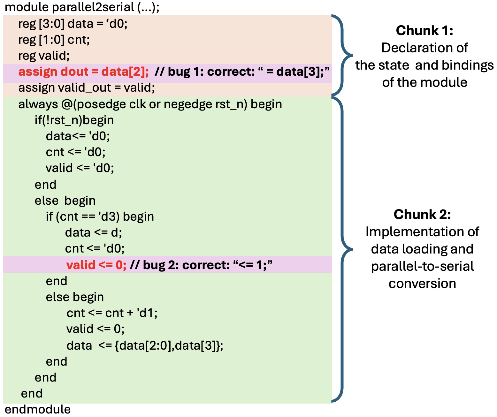

Here are some examples in our manual analysis in Sec. 2, including semantically tight chunks split from Verilog modules and the mapping between a bug and its semantically tight chunk. The analysis on fixing bug is also presented. Each bug and the code context required to fix it all reside in a single semantically tight chunk. 

Here we provide 6 buggy modules with 28 bugs, where the adder_32_bit, alu, asyn_fifo modules and their bugs are from the MEIC [1] benchmark, and the fsm_full, i2c_master, tate_pairing modules and their bugs are from the Cirfix [2] and RTL_Repair [3] benchmarks. The semantically tight chunks that each module is split into and the mapping relationships from bugs to chunks are annotated in each .v file, with a format similar to Figure 2 in the paper.

[1] Ke Xu, Jialin Sun, Yuchen Hu, Xinwei Fang, Weiwei Shan, Xi Wang, and Zhe Jiang. 2025. MEIC: Re-thinking RTL Debug Automation using LLMs. Proceedings of the 43rd IEEE/ACM International Conference on Computer-Aided Design (ICCAD). Association for Computing Machinery, New York, NY, USA, Article 100, 1–9. https://doi.org/10.1145/3676536.3676801

[2]  Hammad Ahmad, Yu Huang, and Westley Weimer. 2022. CirFix: automatically repairing defects in hardware design code. In Proceedings of the 27th ACM International Conference on Architectural Support for Programming Languages and Operating Systems (ASPLOS '22). Association for Computing Machinery, New York, NY, USA, 990–1003. https://doi.org/10.1145/3503222.3507763

[3] Kevin Laeufer, Brandon Fajardo, Abhik Ahuja, Vighnesh Iyer, Borivoje Nikolić, and Koushik Sen. 2024. RTL-Repair: Fast Symbolic Repair of Hardware Design Code. In Proceedings of the 29th ACM International Conference on Architectural Support for Programming Languages and Operating Systems, Volume 3 (ASPLOS '24), Vol. 3. Association for Computing Machinery, New York, NY, USA, 867–881. https://doi.org/10.1145/3620666.3651346

